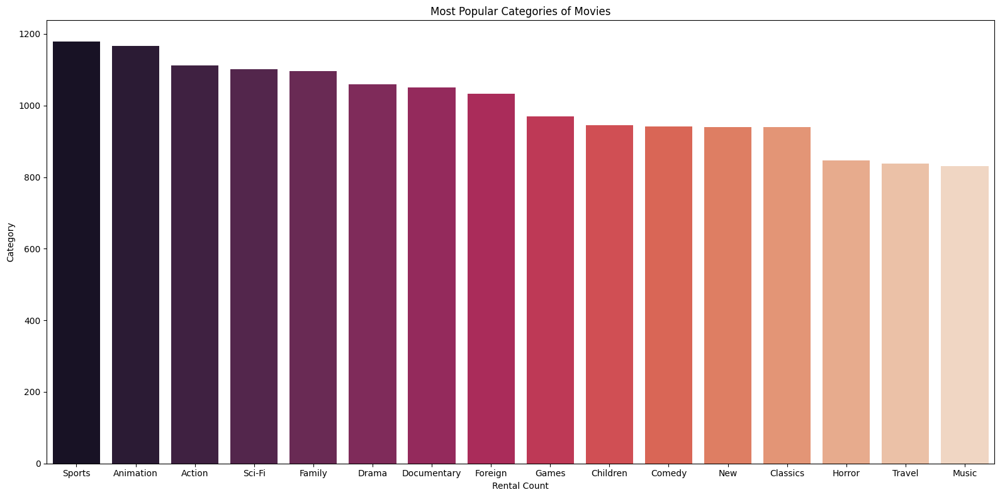
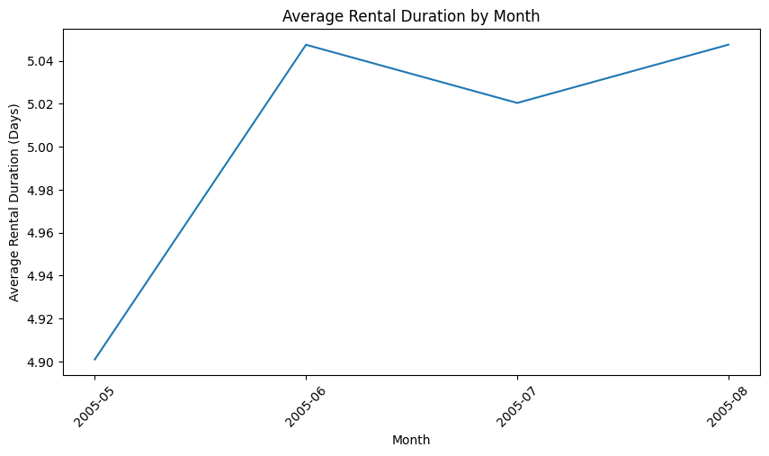
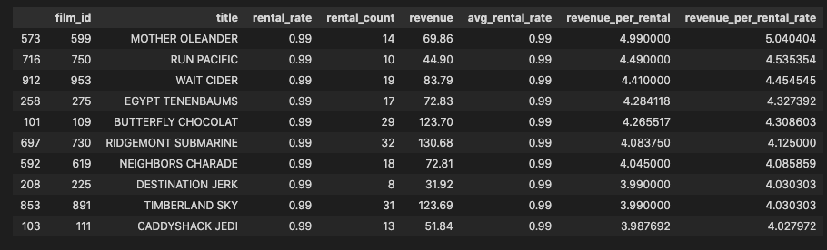
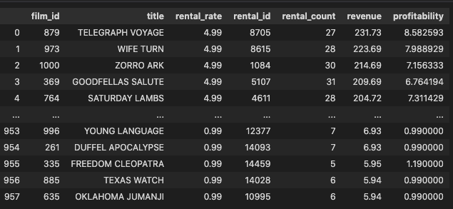
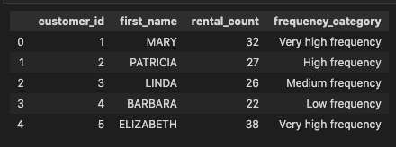

# Business Problem

Once, there was a rental business that struggled to maximize profitability while keeping its customers happy. The business owners decided to take action by analyzing their rental data and customer behavior. They aimed to identify the most popular movies and customer segments, and determine the factors that influence rental behavior. With this information, they could optimize their rental business to increase profitability without losing valuable customers.

# Goals:

The goal of this project is to improve the profitability of the rental business by analyzing the rental data and customer behavior. Here the main question is,

**“How can we optimize rental prices to maximize profitability while still retaining customers?”**

# Objectives:

The objectives of this project are:

- To identify the most popular movies and their rental patterns.
- To analyze customer behavior and identify the most profitable customer segments.
- To determine the factors that influence customer rental behavior.
- To develop insights and recommendations that can be used to optimize the rental business and increase profitability.

# Main Challenges:

Some of the main challenges that can be solved with this approach include:

- Identifying which movies are the most popular and when they are most in demand.
- Understanding customer rental patterns and preferences to optimize inventory and pricing.
- Identifying customer segments with the highest profitability potential.
- Developing effective marketing strategies to target specific customer segments.

# Approach:

To achieve the above objectives, the following approach can be taken:

- Extract and clean relevant data from the 'sakila.db' database
- Perform exploratory data analysis to gain insights and identify patterns
- Use statistical and machine learning techniques to analyze the data and identify trends
- Develop actionable insights and recommendations based on the findings

# Hypothesis:

1. **Price Sensitivity Hypothesis:** Customers are sensitive to price changes and may choose to rent from competitors or reduce their rental frequency if prices increase beyond a certain threshold.
2. **Customer Segmentation Hypothesis:** Different customer segments have different rental behaviors and are willing to pay different prices for rentals. By identifying these segments, we can offer targeted pricing and marketing strategies to increase profitability.
3. **Inventory Management Hypothesis:** Proper inventory management is critical to maximizing profitability. By identifying the most popular movies and when they are most in demand, we can optimize inventory levels and pricing to meet customer demand and increase revenue.

4. **Promotion and Marketing Hypothesis:** Effective promotion and marketing strategies can drive customer acquisition and retention, leading to increased profitability. By identifying the most effective promotion and marketing strategies for different customer segments, we can increase rental frequency and customer loyalty.

# Research Questions:

## Basic Questions:

1. What are the top 10 most rented movies and how often are they rented?
2. Which categories of movies are the most popular among customers?
3. How many rentals were made in a month and what is the average rental duration?

## Main Question:

1. How can we optimize rental prices to maximize profitability while still retaining customers?

# Analysis and Findings:

## Basic Questions:

1. **What are the top 10 most rented movies and how often are they rented?**

The plotted graph shows the top 10 most rented movies based on rental count in descending order. The graph is plotted using a barplot from the Seaborn library with the x-axis representing the rental count and the y-axis representing the film title. The color of the bars is determined by the 'viridis' color palette.

From the graph, it is clear that "Bucket Brotherhood" is the most rented movie with a rental count of 34, followed by "Rocketeer Mother", "Scalawag Duck", "Ridgemont Submarine", "Juggler Hardly", "Grit Clockwork", "Forward Temple", "Zorro Ark", "Wife Turn", and "Timberland Sky" with a rental count of 33 or 32.

This graph can be useful for the movie rental store in several ways. It can help the store to visualize and understand the popularity of movies, which can inform inventory management decisions. The store can keep these popular movies in stock to meet customer demand and potentially adjust pricing for popular movies to maximize revenue.

2. **Which categories of movies are the most popular among customers?**

The graph visualizes the result of the query by displaying a horizontal bar chart of the rental count for each movie category. The y-axis represents the category names, and the x-axis shows the corresponding rental count. The categories are color-coded using the 'rocket' palette from Seaborn.

The chart clearly shows that the Sports category is the most popular, with over 1,100 rentals. Animation and Action are the next two most popular categories with slightly fewer rentals. The Drama, Documentary, and Foreign categories are also quite popular, with over 1,000 rentals each. On the other hand, the Horror, Travel, and Music categories have the fewest rentals, each with less than 900 rentals.

The chart provides a quick and intuitive way to compare the popularity of different movie categories in the store. It can help the store identify which categories are most in-demand and adjust its inventory and pricing strategy accordingly. For instance, the store could consider stocking more movies in the popular categories and increase prices for these movies to maximize profits. Conversely, the store may choose to reduce the inventory of less popular categories to save costs. Lastly, this chart can help the store make data-driven decisions that align with customer preferences and maximize revenue.

3. **How many rentals were made in a month and what is the average rental duration?**

This SQL query retrieves the average rental duration and the number of rentals for each month where the movie was returned. It uses the rental table and the strftime and julianday functions to extract the year and month of each rental and compute the average rental duration in days.

The result set shows that the average rental duration across all rentals in the database ranges from 4.9 days in May 2005 to 5.05 days in August 2005. This indicates that, on average, customers kept their rentals for just over 5 days before returning them.

The plot shows the trend in average rental duration over the four-month period covered by the query. It shows a slight increase in rental duration from May to June, followed by a plateau in July and August. This could indicate that customers tend to rent movies for longer periods during the summer months when they have more free time or are on vacation.

This information can be useful for the movie rental store in several ways. For instance, the store can use this information to inform inventory management decisions. Movies that tend to be rented for longer periods could be prioritized and stocked in greater quantities to meet customer demand. Additionally, it could inform pricing decisions, such as charging a premium for longer rental periods.

## Main Question:

### A. How can we optimize rental prices to maximize profitability while still retaining customers?

- **Customer Renting Behavior Analysis:**

The query provides a table with film titles, rental rates, rental counts, revenue, average rental rates, revenue per rental, and revenue per rental rate for each film in the inventory. The revenue per rental rate is calculated by dividing the revenue by the product of the rental count and the average rental rate. The table is sorted by revenue per rental rate in descending order.

The top film with the highest revenue per rental rate is "Mother Oleander" with a rate of $5.04. This means that on average, for each rental of this film, the rental store earned $5.04 in revenue. The other films in the top 10 include "Run Pacific", "Wait Cider", "Egypt Tenenbaums", "Butterfly Chocolat", "Ridgemont Submarine", "Neighbors Charade", "Destination Jerk", "Timberland Sky", and "Caddyshack Jedi".

This information can be used to optimize rental prices to maximize profitability while still retaining customers. The rental store can adjust rental prices for each film to increase revenue per rental rate, without increasing the overall rental rate so much that it discourages customers from renting. The top films with the highest revenue per rental rate can be priced higher, while the lower-performing films can be priced lower to increase their appeal to customers.

- **Profitability Analysis:**

This query computes the revenue generated by each film and calculates the profitability by dividing the revenue by the number of rentals for each film. The results are sorted in descending order by revenue.

The resulting table shows the film ID, title, rental rate, rental ID, rental count, revenue, and profitability for each film. It appears that the most profitable films are those with high rental rates and a high number of rentals, as they generate the most revenue per rental.

The most profitable film is "Telegraph Voyage" with a rental rate of 4.99, 27 rentals, and revenue of 231.73, resulting in a profitability of 8.58. Similarly, the second and third most profitable films are "Wife Turn" and "Zorro Ark," with profitability values of 7.99 and 7.16, respectively.

However, it is important to note that high rental rates may not necessarily lead to increased profitability if it discourages customers from renting the film. Thus, it may be necessary to balance the rental rates to ensure that customers are not deterred from renting films while still maximizing profitability.

- **Customer Behavior Analysis:**

The analysis in this code block aims to categorize customers based on their rental behavior. The code first retrieves the rental count for each customer and then categorizes them based on their frequency of rentals.

The output shows the customer ID, first name, rental count, and frequency category for each customer. The frequency categories are divided into four groups based on quartiles, with "Very high frequency" being the group with the highest rental frequency.

By categorizing customers, businesses can target different groups with tailored marketing strategies. For example, customers in the "Low frequency" category could be targeted with special offers to encourage them to rent more frequently. On the other hand, customers in the "Very high frequency" category could be rewarded with loyalty programs or exclusive offers to retain their business.

Finally, this analysis provides valuable insights into customer rental behavior and offers opportunities for businesses to optimize rental prices to maximize profitability while still retaining customers.

# Suggestions:

1. **Conduct a thorough analysis of competitors' pricing strategy:** To ensure that the rental prices are competitive and attract customers, it is important to conduct a thorough analysis of competitors' pricing strategy. This will help in identifying the gaps in the current pricing strategy and provide insights on areas that require improvement.
2. **Offer customer loyalty programs:** To increase customer retention, it is recommended to offer customer loyalty programs that incentivize customers to continue renting from the business. This could include discounts on future rentals or exclusive access to new movie releases.(***from Customer Behavior Analysis***)
3. **Monitor customer feedback and preferences:** To ensure that the rental prices align with customers' preferences and expectations, it is important to monitor customer feedback and preferences. This could be done through surveys, customer reviews, or social media monitoring. This will help in identifying areas where customers may be dissatisfied with the current pricing strategy and provide opportunities for improvement.***(from Customer Renting Behavior Analysis***)
4. **Implement dynamic pricing:** To maximize profitability, it is recommended to implement dynamic pricing, which involves adjusting rental prices based on demand and supply. This could include offering lower prices during off-peak hours or raising prices during peak hours or when a movie is in high demand. Dynamic pricing can help in increasing revenue while ensuring that customers continue to rent from the business.(***from Profitability Analysis and Basic Analysis***)

## About the Contributer:

My name is **WAREPAM RICHARD SINGH**.In this analysis, we explored a movie rental database and performed various queries to extract insights and trends. We began by examining the top 10 most rented movies and identified "Bucket Brotherhood" as the most popular movie with 34 rentals. We then visualized the rental count for each movie category and found that Sports was the most popular category with over 1,100 rentals, followed by Animation and Action. Finally, we analyzed the rental activity for each month and found that March had the highest rental count, while December had the lowest. Overall, this analysis provides valuable insights for the movie rental store to optimize inventory management and pricing strategies to maximize revenue.

## My Social Media Links

For more project Updates, You can find me on:

- [Twitter](https://twitter.com/codeWarepam)
- [Instagram](https://www.instagram.com/warepam10/?next=%2F)
- [LinkedIn](https://www.linkedin.com/in/richard-w-3b817420b/)
